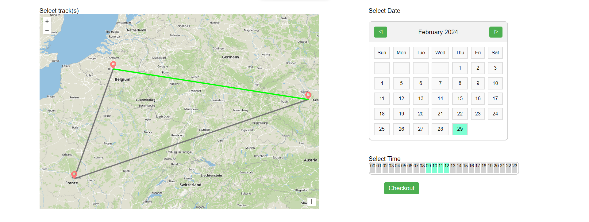
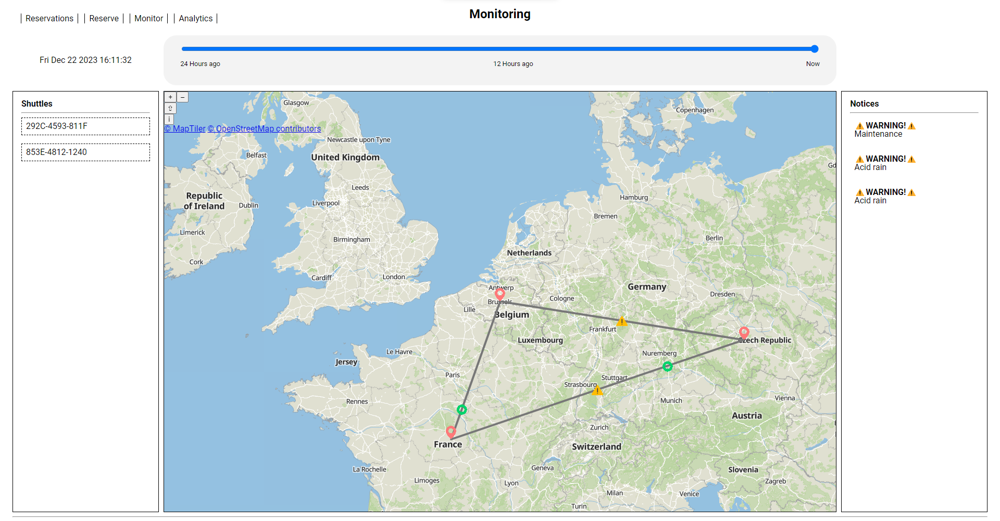
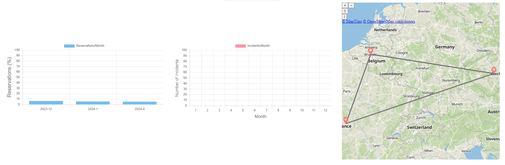

# README for Documentation Repository

## Introduction

Welcome to the documentation repository for our project, **AdriaLinkX**. This repository contains all the documentation for our project.

### Purpose and Value

Our mission with this project is to provide a solution to the lack of safe and cheap transport between colonies. We aim to provide a service that is both convenient and reliable, and that can be used by anyone, regardless of their technical expertise.

## Using the Software

### Prerequisites

To run the application locally, you need the following software installed on your machine:

- Server
  - IntelliJ IDEA (Optional but recommended)
  - Azul Zulu JDK 17

- Client
  - nginx (Recommended) or any other static web server

- Tracker
  - Python 3.X (Tested on 3.11)

### Usage

#### Webpage descriptions

The application is comprised of multiple webpages, each catering to a specific function. Here's an overview of each webpage and its features:

1. **Index**
   - The index page shows a dashboard with the available tools. You can choose to monitor the shuttles, view reservations or go to the analytics.
    

2. **Reserve**
   - The reserve page allows you to reserve tracks. Here you can choose the date, time, and route you wish to reserve.
    
    *Note: In the screenshot a track, date and timeframe are selected just for demonstration purposes.*

3. **Reservation**
   - The reservation page allows you to review & place new reservations.
    

4. **Shuttle Monitor**
   - The monitoring page gives you a view of the location of each shuttle. On this page you can also inspect any ongoing disturbances and can even use the timeline at the top to go back in time.
    

5. **Analytics**
   - The analytics page allows you to look at the data collected by the system. This data includes reservations and warnings grouped by month, but also has a map showing which tracks are more commonly reserved.
    

## Getting Started

### Accessing the App

To experience the live application, visit [the live application](https://project-2.ti.howest.be/2023-2024/group-12/).

### Local Development

#### Running the Server

Set up and run the server locally by following these steps:

- Pull the server repository into a folder of your choice: `git clone https://gitlab.ti.howest.be/ti/2023-2024/s3/analysis-and-development-project/projects/group-12/server.git`

From here, you have two options:

- Run the server using IntelliJ IDEA
  1. Open the project in IntelliJ IDEA
  2. Run the server from the IDE by executing the `run` task under `application` in the Gradle sidebar

- Run the server via the command line
  1. Open a terminal in the project directory
  2. Run the server:
     - Windows: `gradlew.bat run`
     - Linux/MacOS: `./gradlew run`

---

#### Running the Client

Set up and run the client locally by following these steps:

The client is a static website, so you can run it using any web server. We recommend using nginx on Ubuntu/Debian or MacOS.

*If you are using Windows, you can use the [Windows Subsystem for Linux](https://docs.microsoft.com/en-us/windows/wsl/) to run Ubuntu/Debian*

1. Change the current working directory to your user's home directory: `cd ~`
2. Pull the client repository: `git clone https://gitlab.ti.howest.be/ti/2023-2024/s3/analysis-and-development-project/projects/group-12/client.git`
3. For local hosting, you first need to confugure the `config.json`. Replace the contents from:

   ```json
   {
    "host": "https://project-2.ti.howest.be",
    "folder": "",
    "year": "2023-2024",
    "group": "group-12"
   }
   ```

   to

   ```json
   {
    "host": "http://localhost:8080",
    "folder": "",
    "year": "",
    "group": ""
   }
   ```

The steps below may differ depending on your operating system:

1. Install nginx if not yet installed:
   - Ubuntu/Debian: `sudo apt install nginx`
   - MacOS: `brew install nginx`

2. Edit the nginx config file: `sudo nano /etc/nginx/conf.d/default.conf`
     - Replace the contents of the file with the following:

       ```nginx
       server {
           listen 80 default_server;

           root <Project directory>/src;
           index index.html index.htm;

           server_name localhost;

           location / {
               try_files $uri $uri/ =404;
           }
       }
       ```
    - Replace `<Project directory>` with the path to the project that you just cloned.

3. Start nginx:

   - Ubuntu/Debia: `sudo systemctl start nginx`
   - MacOS: `sudo brew services start nginx`

4. Open a browser and navigate to `localhost`

---

#### Running the Tracker

- Pull the tracker repository into a folder of your choice: `git clone https://gitlab.ti.howest.be/ti/2023-2024/s3/analysis-and-development-project/projects/group-12/tracker.git`

Set up and run the tracker (shuttle & warning simulator) locally by following these steps:

1. Open a terminal in the project directory
2. Create a virtual environment: `python3 -m venv venv`
3. Activate the virtual environment:
   - Windows: `venv\Scripts\activate.bat`
   - Linux/MacOS: `source venv/bin/activate`

4. Install the required packages: `pip install -r requirements.txt`
5. Run the tracker: `python tracker.py`

## Code Quality

### SonarQube Dashboard

We use SonarQube to monitor the quality of our code. Here you can find the links to our SonarQube dashboards:

- [Client Deshboard](https://sonarqube.ti.howest.be/dashboard?id=2023.project-2%3Aadria-client-12)
- [Server Dashboards](https://sonarqube.ti.howest.be/dashboard?id=2023.project-2%3Aadria-server-12)

## Understanding the Documentation

### Folder Structure

The documentation repository is structured as follows:

- `documentation/`
  - `api-spec/`
    - [`openapi.yaml`](api-spec/openapi.yaml)
  - `business-case/`
    - [`business-case.pdf`](business-case/business-case.pdf)
  - `user-tests/`
    - [`user-tests.docx`](user-tests/user-tests.docx)
  - `schematics/`
    - [`c4.png`](schematics/c4.png)
    - [`erd.png`](schematics/erd.png)
    - [`flowcharts.png`](schematics/flowcharts.png)
    - [`ucd.png`](schematics/ucd.png)
  - [`README.md`](README.md)

### Technical Docs

For technical documentation, consult the following files:

- [C4 diagrams](schematics/c4.png)
- [Entity-Relationship Diagrams (ERDs)](schematics/erd.png)
- [Flowcharts](schematics/flowcharts.png)
- [Use Case Diagrams (UCDs)](schematics/ucd.png)

### Wireframes

For our wireframe, we have 3 different flows:

1. How an exisiting client sees the application: [Existing Client](https://www.figma.com/proto/JcqhwcRL1Pwpy8XyHXFNI9/AD?type=design&node-id=0-1&t=DR4dgbZR0iYEakf4-0&scaling=scale-down&starting-point-node-id=391%3A1400)
2. How a new client sees the application: [New Client](https://www.figma.com/proto/JcqhwcRL1Pwpy8XyHXFNI9/AD?type=design&node-id=0-1&t=DR4dgbZR0iYEakf4-0&scaling=scale-down&starting-point-node-id=402%3A5960)
3. How the admin sees the application: [Admin](https://www.figma.com/proto/JcqhwcRL1Pwpy8XyHXFNI9/AD?type=design&node-id=0-1&t=DR4dgbZR0iYEakf4-0&scaling=scale-down&starting-point-node-id=391%3A1419)

### Business Case

Refer to the [Business Case Document](https://docs.google.com/document/d/1KgKLgSN-0K7Lq6ORozE_DI7pTmq-jCV59zkQCXIQixg/edit?usp=sharing) for a detailed understanding of the project's goals and objectives.

For an offline version of the business case, refer to the [folder structure](#folder-structure)

## Implemented Topics

### Class Taught Topics

Integration of class-taught topics into our project includes:

- Graphs
- Maps

### Self-Study Topics

During the development of this application, we covered the following self-study topics:

- Use of higher order functions on the server:
  - matchAny, filter, allMatch, map

- Push notifications (Notification API):
  - Push notifications are used to notify the client when an incident occurs.
    For example, when a track is blocked, the client will receive a notification.

## Incomplete features

### Dropped use cases
- Performance or delay tracking of shuttles
- Time availability indication

### Known bugs
- It is possible to double reserve a route
- User is redirected even when reservation fails

## Additional Information

### Marketing Website

Our marketing website is hosted on WordPress. You can find the link to our website [here](https://adrialinkx.wordpress.com/).

### User Tests

As required, we have conducted several user tests. You can find the results of these tests [here](user-tests/user-tests.docx).

### Flow demonstrations

Additionally, we have conducted demonstrations for 3 different flows:

1. [I am a new client and I want to reserve a track.](flow-tests/new_client.mp4)
2. [I am an existing client and want to view my reservations.](flow-tests/client.mp4)
3. [I am an admin and want to view the analytics.](flow-tests/admin.mp4)

## Meet the Team

Discover the talented individuals behind the project:

### **Kassam Ahmad**

#### CEO

*Contribution:* Client-side development, Map technology research, Map API integration

### **Vanhoorne Bram**

#### COO

*Contribution:* Head of development, Server-side development, Database design, OpenAPI documentation, Server-side testing, Map technology research

### **Nadeem Mohamed Sharfudden**

#### CTO

*Contribution:* Final financial calculations, Presentation financial calculations

### **Popal Ares**

#### Head of Partnerships

*Contribution:* Alpha business case, Final presentation, client-side development
