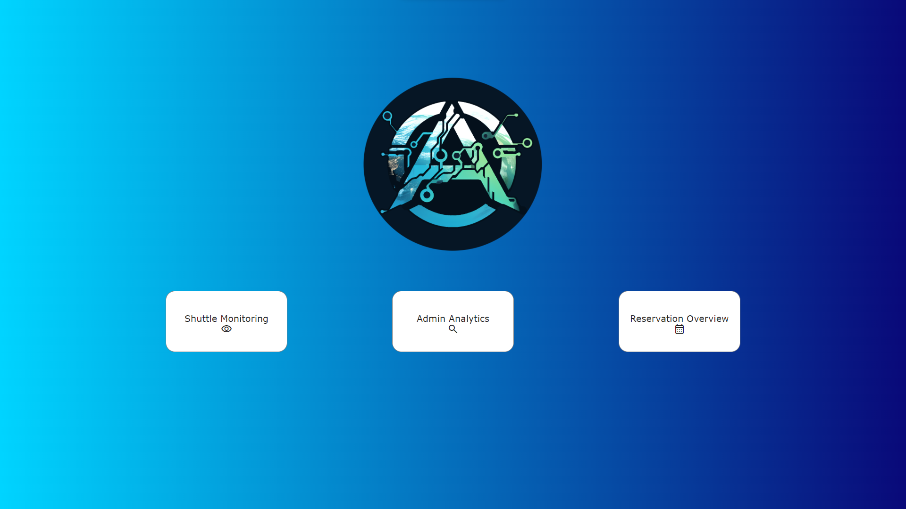
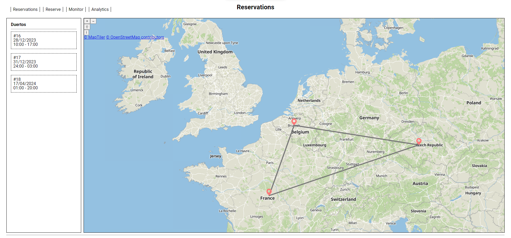

# README for Documentation Repository

## Introduction

Welcome to the documentation repository for our project, **AdriaLinkX**. This repository contains all the documentation for our project.

### Purpose and Value

Our mission with this project is to provide a solution to the problem of the lack of a safe and cheap shuttle service between colonies. We aim to provide a service that is both convenient and reliable, and that can be used by anyone, regardless of their technical expertise.

## Using the Software

### Prerequisites

Before starting, you have to check if your system meets the following requirements:

- Server
  - IntelliJ IDEA
  - Azul Zulu JDK 17
  - **OR**
  - Azul Zulu JDK 17

- Client
  - nginx

- Tracker
  - Python 3.x

### Usage

#### Webpage descriptions

The application comprises multiple webpages, each catering to a specific function. Here's an overview of each webpage and its features:

1. **Index**
   - The index page provides you with a dashboard of options to choose from. You can choose to monitor the shuttles, view the analytics, or view the reservations.
    

2. **Reserve**
   - The reserve page allows you to reserve tracks. You can choose the date, time, and destination of your trip.
    
    *Note: In the screenshot a track, date and timeframe are selected just for demonstration purposes.*

3. **Reservation**
   - The reservation page allows you to reserve tracks. You can choose the date, time, and destination of your trip.
    

4. **Shuttle Monitor**
   - The shuttle monitor page allows you to view the current location of all shuttles. You can view shuttle's current route and track's current status or using the history bar you can view older shuttles and tracks statuses.
    

5. **Analytics**
   - The analytics page allows you to view the analytics of the system. You can view the number of reservations per month and the number of incidents per month.
    

## Getting Started

### Accessing the App

To experience the live application, visit [the live application](https://project-2.ti.howest.be/2023-2024/group-12/).

### Local Development

#### Running the Server

Set up and run the server locally by following these steps:

- Pull the server repository into a folder of your choice: `git clone https://gitlab.ti.howest.be/ti/2023-2024/s3/analysis-and-development-project/projects/group-12/server.git`

From here, you have two options:

- Run the server using IntelliJ IDEA
  1. Open the project in IntelliJ IDEA
  2. Run the server from the IDE by executing the `run` task under `application` in the Gradle sidebar

- Run the server via the command line
  1. Open a terminal in the project directory
  2. Run the server:
     - Windows: `gradlew.bat run`
     - Linux/MacOS: `./gradlew run`

#### Running the Client

Set up and run the client locally by following these steps:

1. 2

#### Running the Tracker

- Pull the tracker repository into a folder of your choice: `git clone https://gitlab.ti.howest.be/ti/2023-2024/s3/analysis-and-development-project/projects/group-12/tracker.git`

Set up and run the tracker (shuttle & notice simulator) locally by following these steps:

1. Open a terminal in the project directory
2. Create a virtual environment: `python3 -m venv venv`
3. Activate the virtual environment:
   - Windows: `venv\Scripts\activate.bat`
   - Linux/MacOS: `source venv/bin/activate`

4. Install the required packages: `pip install -r requirements.txt`
5. Run the tracker: `python tracker.py`

## Code Quality

### SonarQube Dashboard

We use SonarQube to monitor the quality of our code. Here you can find the links to our SonarQube dashboards:

- [Client Deshboard](https://sonarqube.ti.howest.be/dashboard?id=2023.project-2%3Aadria-client-12)
- [Server Dashboards](https://sonarqube.ti.howest.be/dashboard?id=2023.project-2%3Aadria-server-12)

## Understanding the Repositories

### Folder Structure

The server, client and tracker repositories are structured as follows:

- Server
  - ...
- Client
  - ...
- Tracker
  - ...

### Technical Docs

For technical documentation, consult the following files:

- Entity-Relationship Diagrams (ERDs)
- C4 diagrams
- Flowcharts

### Wireframes

Review the initial design of the application through our [wireframes](link_to_wireframes).

### Business Case

Refer to the [Business Case Document](#) for a detailed understanding of the project's goals and objectives.

## Implemented Topics

### Self-Study Topics

During the development of this application, we covered the following self-study topics:

- topic

### Class Taught Topics

Integration of class-taught topics into our project includes:

- topic

## Meet the Team

Discover the talented individuals behind the project:

- **Bram**
  - *Role:* [Role]
  - *Contribution:* [Describe contributions]

- **Ahmad**
  - *Role:* [Role]
  - *Contribution:* [Describe contributions]

- **Mohamed**
  - *Role:* [Role]
  - *Contribution:* [Describe contributions]

- **Ares**
  - *Role:* [Role]
  - *Contribution:* [Describe contributions]
